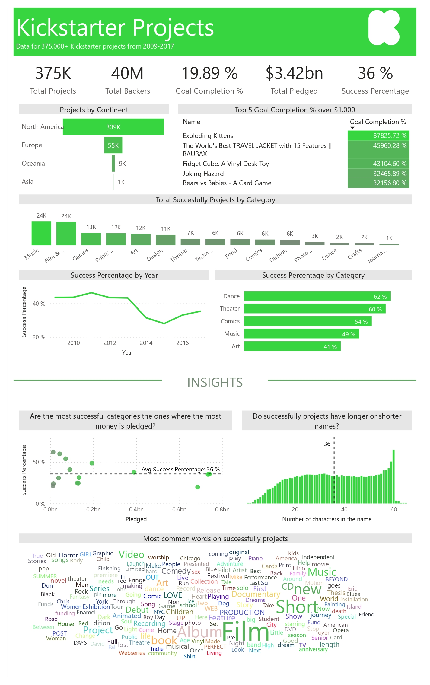
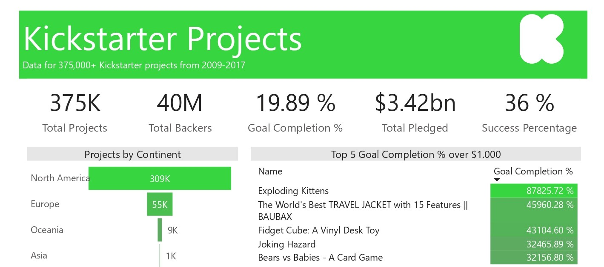
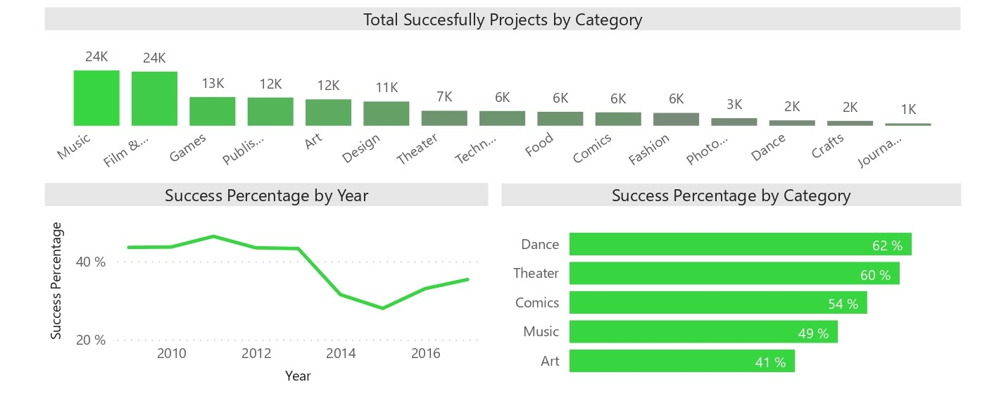
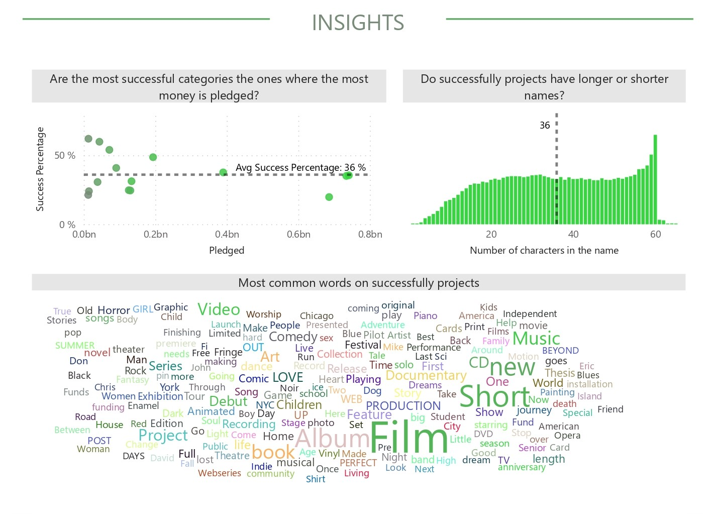

## Introduction ##
Kickstarter is an American public benefit corporation, that maintains a global crowdfunding platform focused on creativity. The company's stated mission is to "help bring creative projects to life". As of July 2021, Kickstarter has received nearly $6 billion in pledges from 20 million backers to fund 205,000 projects, such as films, music, stage shows, comics, journalism, video games, technology, publishing, and food-related projects.

## Source ##
The data source is [Maven Analytics]( https://www.mavenanalytics.io/data-playground).
You cand find the data dictionary at this [link](https://github.com/morales-francisco/Dashboards/blob/main/Kickstarter/Data/kickstarter_projects_data_dictionary.csv).

## Case of Analysis ##

As part of the Kickstarter's data analytics team, I was called on to participate in the annual board meeting to answer some questions.

Those questions were as follows:
- How much money was pledged?
- What project with a goal over $1,000 USD, had the biggest Goal Completion % (Pledged / Goal)?
- How many projects have been successful?
- Which category has the highest success percentage?
- Can you identify any trends in project success rates over the years?
- As an investor, what types of projects should you be looking at to guarantee future success?

## Dashboard Design ##

Once the analysis requirements were defined, I created the following dashboard.
[Download the .pbix file](https://github.com/morales-francisco/Dashboards/raw/main/Kickstarter/kickstarter-projects.pbix).

## Analysis and Conclusions ##

In order to answer the first questions, I did an overall analysis of all the projects

- Total Projects: 375 K
- Total Backers: 40 M
- Goal Completion % (Avg) : 19.89%
- Total Pledged: 3.42 bn
- Succes Percentage (Avg): 36% 

Of all projects, 82% are in North America, 14% in Europe and the remaining distributed between Oceania and Asia.

The 5 projects with the biggest Completion Goal over $1,000 are:
- Exploding Kittens
- The World’s Best TRAVEL JACKET with 15 Features || BAUBAX
- Fideget Cube: A Vinyl Desk Toy
- Joking Hazard
- Bears vs Babies – A Card Game  

From the above image we can also observe the number of projects that were successful. 
About 36% of the projects were successful, which would translate into around 135.000.

The 5 categories with the highest success percentage are:
- Dance: 62%
- Theater: 60% 
- Comics: 54%
- Music: 49%
- Art: 41% 

Of the total number of successful projects, more than 60% are being distributed among the 5 main categories, with Music 18% (24K), Film & Video 18% (24K), Games 9% (13K), Publish 9% (12K) and Art 9% (12K).

Different trends are seen over the years with respect to the project success rates.
From 2009 to 2011 it grew from 44% to 46%, while from 2011 to 2015 the percentage dropped to 28%, this being its lowest point within the analyzed periods. From that moment it grew until the last year analyzed (2017), from up to 35%.

And in order to attend the last question, I proposed some points that could be interesting to analyze such as:

- **The length of the project names**. 50% of the successful projects have 36 characters or less.  This could be a good indicator that backers are not attracted to projects with very long names, but rather prefer short ones.

- Another aspect I analyzed is **whether the most successful categories are the most pledged**. I found that this is not necessarily the case. The graph shows that the most successful categories are the ones that were pledged the least. The categories that were pledged the most are slightly below the average success percentage.

- And finally, I analyzed the **most used words om successful projects**, highlighting the following words: Film, Album, Short, New, Music, book, Video, Project, among others.

