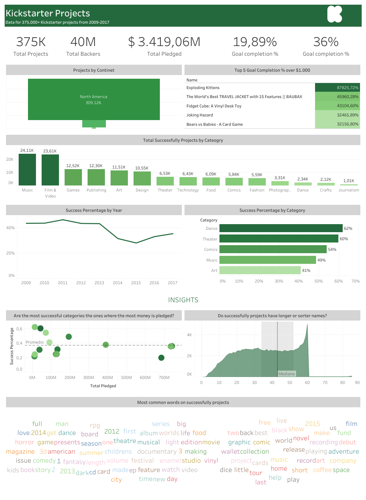

## Introduction ##
Kickstarter is an American public benefit corporation, that maintains a global crowdfunding platform focused on creativity. The company's stated mission is to "help bring creative projects to life". As of July 2021, Kickstarter has received nearly $6 billion in pledges from 20 million backers to fund 205,000 projects, such as films, music, stage shows, comics, journalism, video games, technology, publishing, and food-related projects.

This project was done in

- [Power BI](https://github.com/morales-francisco/Dashboards/raw/main/Kickstarter/kickstarter-projects.pbix)
- [Tableau](https://public.tableau.com/app/profile/francisco8213/viz/Kickstarterprojects_16917120723780/KickstarterDashboard)

## Source ##
The data source is [Maven Analytics]( https://www.mavenanalytics.io/data-playground).
You cand find the data dictionary at this [link](https://github.com/morales-francisco/Dashboards/blob/main/Kickstarter/Data/kickstarter_projects_data_dictionary.csv).

## Case of Analysis ##

As part of the Kickstarter's data analytics team, I was called on to participate in the annual board meeting to answer some questions.

Those questions were as follows:
- How much money was pledged?
- What project with a goal over $1,000 USD, had the biggest Goal Completion % (Pledged / Goal)?
- How many projects have been successful?
- Which category has the highest success percentage?
- Can you identify any trends in project success rates over the years?
- As an investor, what types of projects should you be looking at to guarantee future success?

## Dashboard Design ##

### Power BI ###
Once the analysis requirements were defined, I created the following dashboards.

[Download the .pbix file](https://github.com/morales-francisco/Dashboards/raw/main/Kickstarter/kickstarter-projects.pbix)

### Tableau ###
[Link to Tableau Public](https://public.tableau.com/app/profile/francisco8213/viz/Kickstarterprojects_16917120723780/KickstarterDashboard)

## Analysis and Conclusions ##

I conducted an overall analysis of all the projects to help me respond to the first questions:

- Total Projects: 375 K
- Total Backers: 40 M
- Goal Completion % (Avg) : 19.89%
- Total Pledged: 3.42 bn
- Succes Percentage (Avg): 36% 

Eighty-two percent of all projects are in North America, fourteen percent are in Europe, and the remaining projects are split between Oceania and Asia.

The 5 projects with the biggest Completion Goal over $1,000 are:
- Exploding Kittens
- The World’s Best TRAVEL JACKET with 15 Features || BAUBAX
- Fideget Cube: A Vinyl Desk Toy
- Joking Hazard
- Bears vs Babies – A Card Game  

We can also see how many projects were successful from the image up top. 
It is estimated that 135.000 projects, or about 36% of them, were successful.

The 5 categories with the highest success percentage are:
- Dance: 62%
- Theater: 60% 
- Comics: 54%
- Music: 49%
- Art: 41% 

More than 60% of all successful projects fall into one of the five major categories, with music accounting for 18% (24K), film & video for 18% (24K), games for 9% (13K), publishing for 9% (12K), and art for 9%. (12K).

When it comes to project success rates, different trends have been observed over time. 
It increased from 44% to 46% between 2009 and 2011, but fell to 28% between 2011 and 2015, marking its lowest point over the studied time periods. From that point until the last year examined (2017), it increased by up to 35%.

And in response to the final question, I offered a few ideas that might be worth exploring, including:

- **The length of the project names**. 36 characters or fewer are used in 50% of projects that are successful. This may be a strong indication that backers prefer short project names over those with very long ones.

- I also looked into **whether the most popular categories received the most pledges**. I discovered that this isn't always the case. The graph demonstrates that the categories with the lowest pledges are the most prosperous. The most pledged categories have slightly lower success rates than average.

- Finally, I looked at **the words that were most frequently used in successful projects**, highlighting phrases like "film," "album," "short," "new," "music," "book," "video," and "project," among others.

