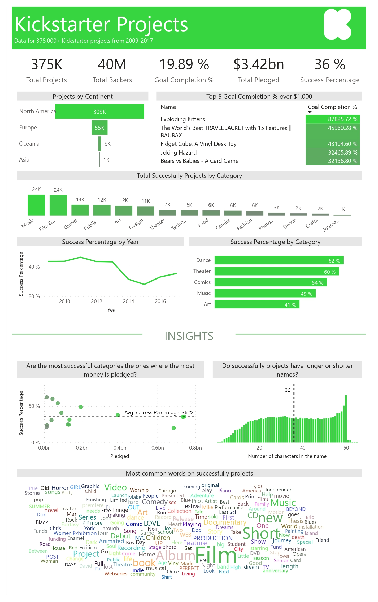

## Introduction ##
Kickstarter is an American public benefit corporation, that maintains a global crowdfunding platform focused on creativity. The company's stated mission is to "help bring creative projects to life". As of July 2021, Kickstarter has received nearly $6 billion in pledges from 20 million backers to fund 205,000 projects, such as films, music, stage shows, comics, journalism, video games, technology, publishing, and food-related projects.

## Source ##
The data source is [Maven Analytics]( https://www.mavenanalytics.io/data-playground).
You cand find the data dictionary at this [link](https://github.com/morales-francisco/Dashboards/blob/main/Kickstarter/Data/kickstarter_projects_data_dictionary.csv).

## Case of Analysis ##

As part of the Kickstarter's data analytics team, I was called on to participate in the annual board meeting to answer some questions.

Those questions were as follows:

- Which category has the highest success percentage? How many projects have been successful?
- What project with a goal over $1,000 USD, had the biggest Goal Completion % (Pledged / Goal)? How much money was pledged?
- Can you identify any trends in project success rates over the years?
- As an investor, what types of projects should you be looking at to guarantee future success?

## Dashboard Design ##

Once the analysis requirements were defined, the following dashboard was created.
[Download the .pbix file](https://github.com/morales-francisco/Dashboards/raw/main/Kickstarter/kickstarter-projects.pbix).

