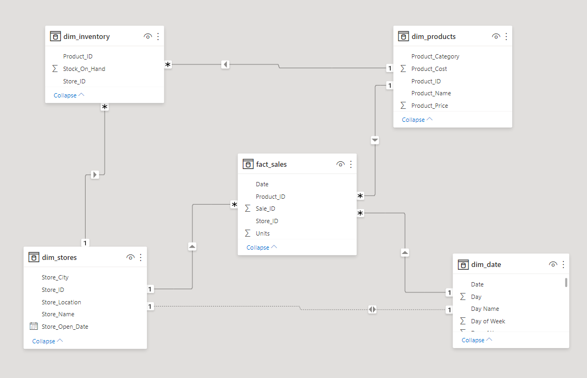
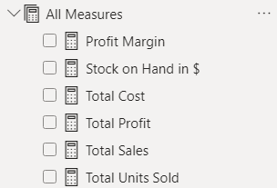
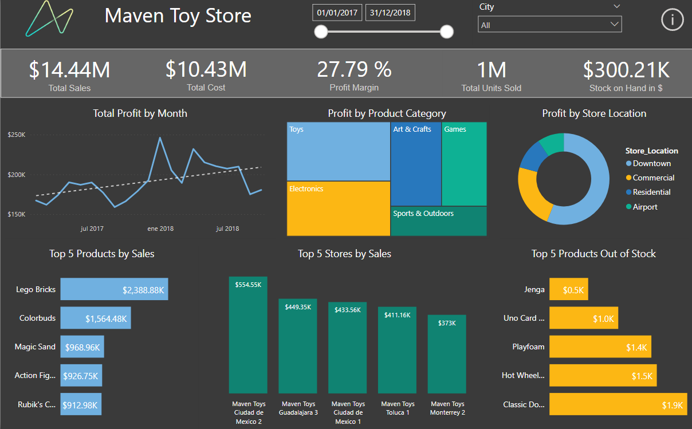
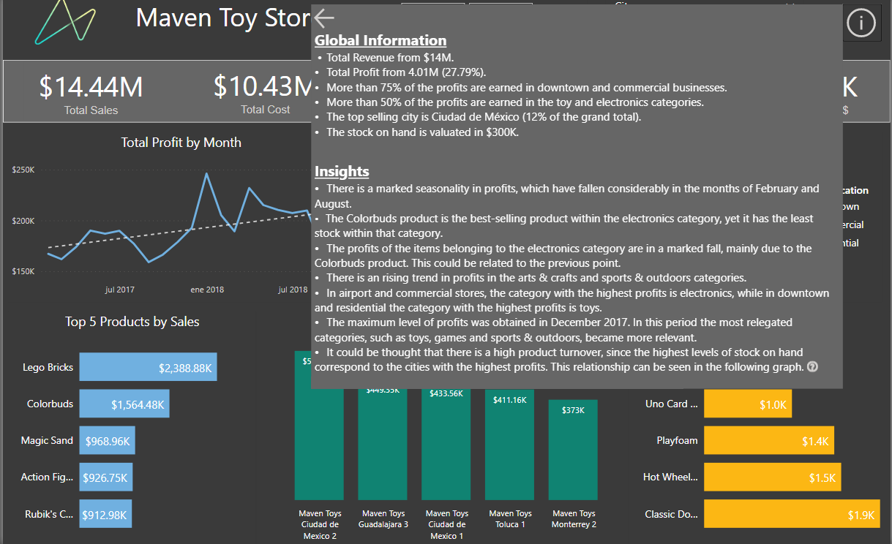
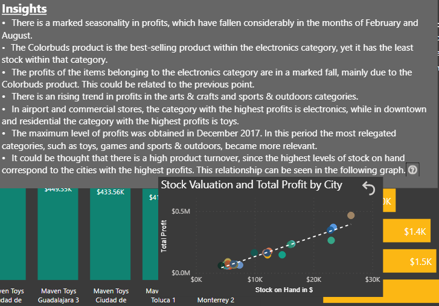

# Maven Toys in Power BI #

## Introduction ##
Maven Toys is a fictitious chain of toy stores in Mexico. This dataset includes information about products, stores, daily sales transactions, and current inventory levels at each location. 

## Source ##
The data source is [Maven Analytics]( https://www.mavenanalytics.io/data-playground).
This project use the same data as ["Exploratory Data Analysis - Maven Toys"](https://github.com/morales-francisco/SQL-Projects/tree/main/ToysMaven)

## Case of Analysis ##

The Sales Manager from Maven Toys Company request an executive sales report.
Based on the request made by the company, we proposed the following analysis:
- Global Information about sales, profit and stock on hand.
- Which product categories drive the biggest profits? Is this the same across store locations?
- Find any seasonal trends or patterns in the sales data.
- Discover insights about sales data.

## Data Modeling and Preparing ##

The Sales Manger give me information about products, stores, daily sales transactions, and current inventory levels at each location
According to that, I proceeded to create the data model.

## Dashboard Design ##

Once the data model was defined, I proceeded to create the necessary measures.

After that, the next step, is the creation of the dashboard.

