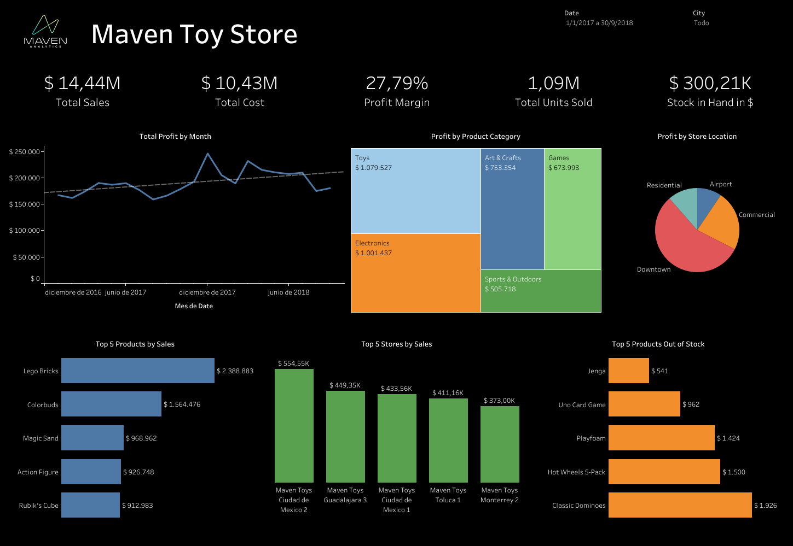

# Maven Toys in Power BI + Tableau #

## Introduction ##
Maven Toys is a fictitious chain of toy stores in Mexico. This dataset includes information about products, stores, daily sales transactions, and current inventory levels at each location. 

This project was done in

- [Power BI](https://github.com/morales-francisco/Dashboards/raw/main/MavenToys/MavenToys.pbix)
- [Tableau](https://public.tableau.com/app/profile/francisco8213/viz/MavenToysDashboard_16917831008940/MavenToysDashboard)

## Source ##
The data source is [Maven Analytics]( https://www.mavenanalytics.io/data-playground).
This project use the same data as ["Exploratory Data Analysis - Maven Toys"](https://github.com/morales-francisco/SQL-Projects/tree/main/ToysMaven)

## Case of Analysis ##

The Sales Manager from Maven Toys Company request an executive sales report.
Based on the request made by the company, we proposed the following analysis:
- Global Information about sales, profit and stock on hand.
- Which product categories drive the biggest profits? Is this the same across store locations?
- Find any seasonal trends or patterns in the sales data.
- Discover insights about sales data.

## Data Modeling and Preparing ##

The sales manager provides me with details about the products, stores, daily sales activity, and present inventory levels at each location.
According to that, I proceeded to create the data model.

## Dashboard Design ##

### Tableau ###

[Link to Tableau Public](https://public.tableau.com/app/profile/francisco8213/viz/MavenToysDashboard_16917831008940/MavenToysDashboard)

### Power BI ###

[Download the .pbix file](https://github.com/morales-francisco/Dashboards/raw/main/MavenToys/MavenToys.pbix)

## Analysis and Conclusions ##

Global Information
- Total Revenue from $14M.
- Total Profit from 4.01M (27.79%).
- More than 75% of the profits are earned in downtown and commercial businesses.
- More than 50% of the profits are earned in the toy and electronics categories.
- The top selling city is Ciudad de México (12% of the grand total).
- The stock on hand is valuated in $300K.

Discovers

- Profits have experienced a significant seasonal decline between the months of February and August.

- Despite having the least amount of stock in the electronics category, the Colorbuds product is the best-selling item there.

- Electronics products' profits have significantly decreased, primarily as a result of the Colorbuds product. This might be connected to the previous statement.

- The categories of arts & crafts and sports & outdoor activities are seeing an increase in profits.

- Electronics are the product category with the highest profits in airport and commercial stores, while toys are the product category with the highest profits in residential and downtown areas.

- In December 2017, the company's profits reached their peak level. During this time, the least important categories—like toys, games, and sports & outdoors—became more important.

- Since the cities with the highest profits also have the highest levels of stock on hand, it might be assumed that there is a high product turnover.

