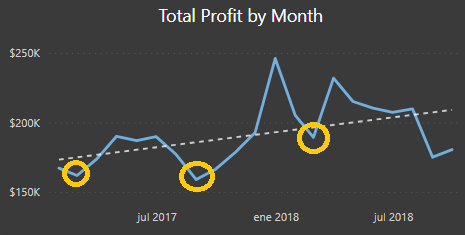
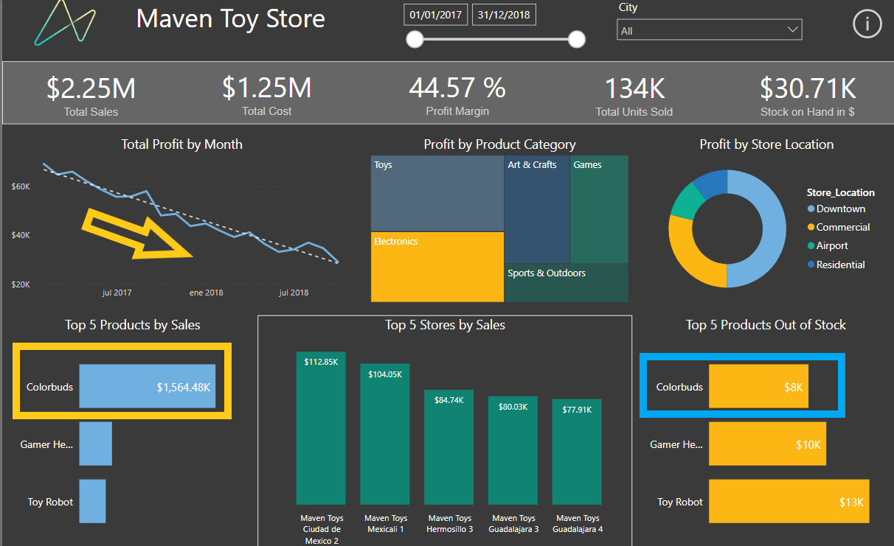
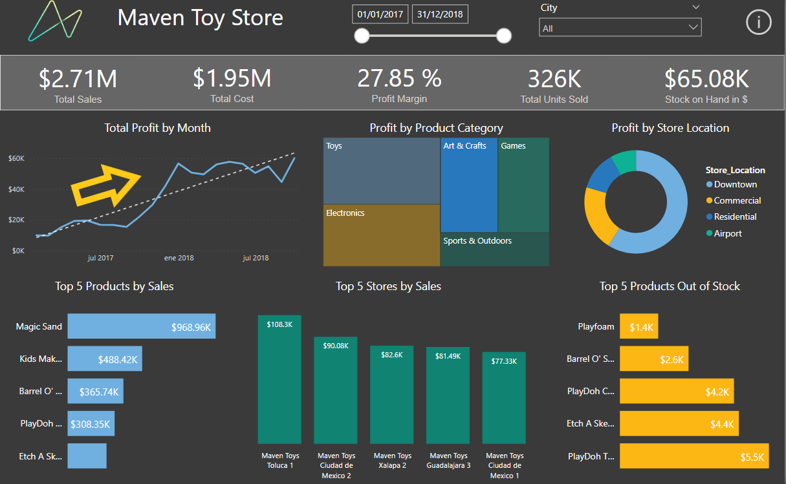
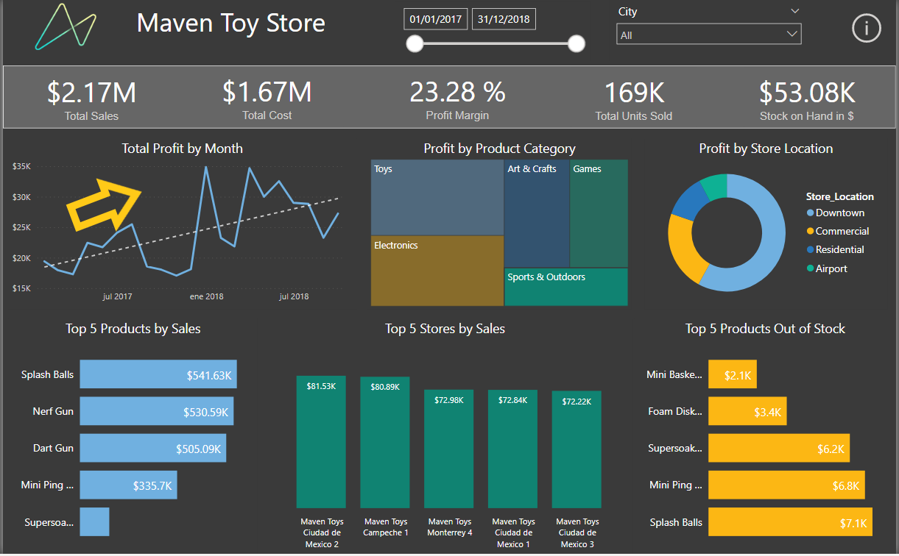
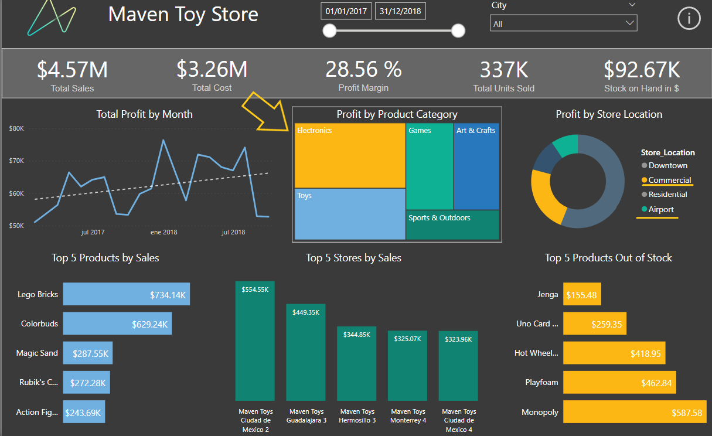
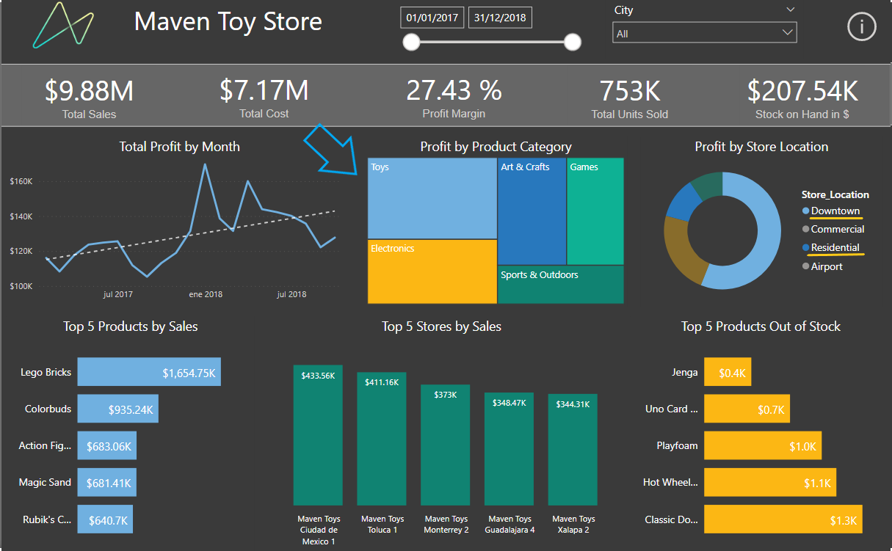
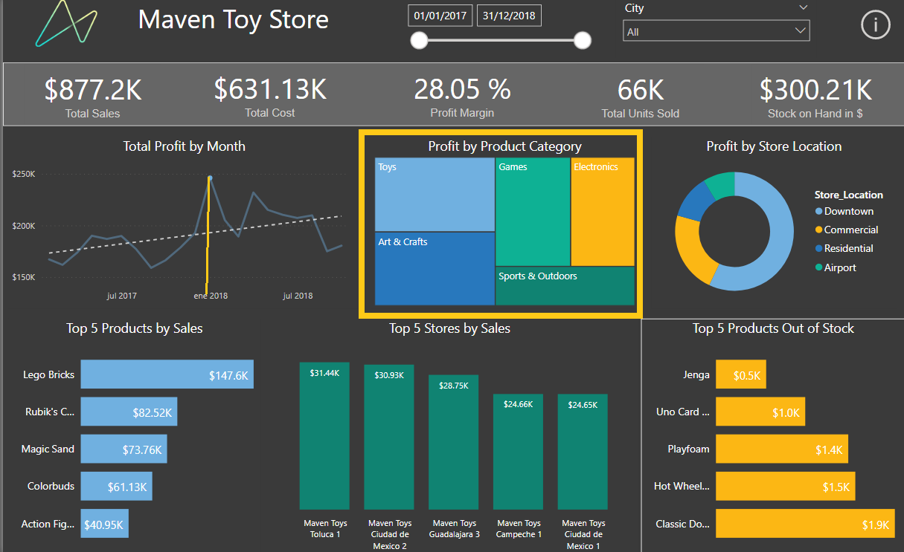
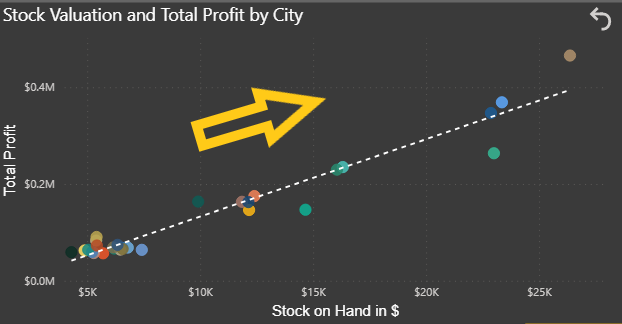

# Maven Toys in Power BI #

## Introduction ##
Maven Toys is a fictitious chain of toy stores in Mexico. This dataset includes information about products, stores, daily sales transactions, and current inventory levels at each location. 

## Source ##
The data source is [Maven Analytics]( https://www.mavenanalytics.io/data-playground).
This project use the same data as ["Exploratory Data Analysis - Maven Toys"](https://github.com/morales-francisco/SQL-Projects/tree/main/ToysMaven)

## Case of Analysis ##

The Sales Manager from Maven Toys Company request an executive sales report.
Based on the request made by the company, we proposed the following analysis:
- Global Information about sales, profit and stock on hand.
- Which product categories drive the biggest profits? Is this the same across store locations?
- Find any seasonal trends or patterns in the sales data.
- Discover insights about sales data.

## Data Modeling and Preparing ##

The Sales Manger give me information about products, stores, daily sales transactions, and current inventory levels at each location
According to that, I proceeded to create the data model.

## Dashboard Design ##

Once the data model was defined, I proceeded to create the necessary measures. [Download the .pbix file](https://github.com/morales-francisco/Dashboards/raw/main/MavenToys/MavenToys.pbix)

After that, the next step, is the creation of the dashboard.

## Analysis and Conclusions ##
Global Information

- Total Revenue from $14M.
- Total Profit from 4.01M (27.79%).
- More than 75% of the profits are earned in downtown and commercial businesses.
- More than 50% of the profits are earned in the toy and electronics categories.
- The top selling city is Ciudad de México (12% of the grand total).
- The stock on hand is valuated in $300K.

Discovers

- There is a marked seasonality in profits, which have fallen considerably in the months of February and August.

- The Colorbuds product is the best-selling product within the electronics category, yet it has the least stock within that category.

- The profits of the items belonging to the electronics category are in a marked fall, mainly due to the Colorbuds product. This could be related to the previous point.

- There is an rising trend in profits in the arts & crafts and sports & outdoors categories.

- In airport and commercial stores, the category with the highest profits is electronics, while in downtown and residential the category with the highest profits is toys.

- The maximum level of profits was obtained in December 2017. In this period the most relegated categories, such as toys, games and sports & outdoors, became more relevant.

- It could be thought that there is a high product turnover, since the highest levels of stock on hand correspond to the cities with the highest profits.

