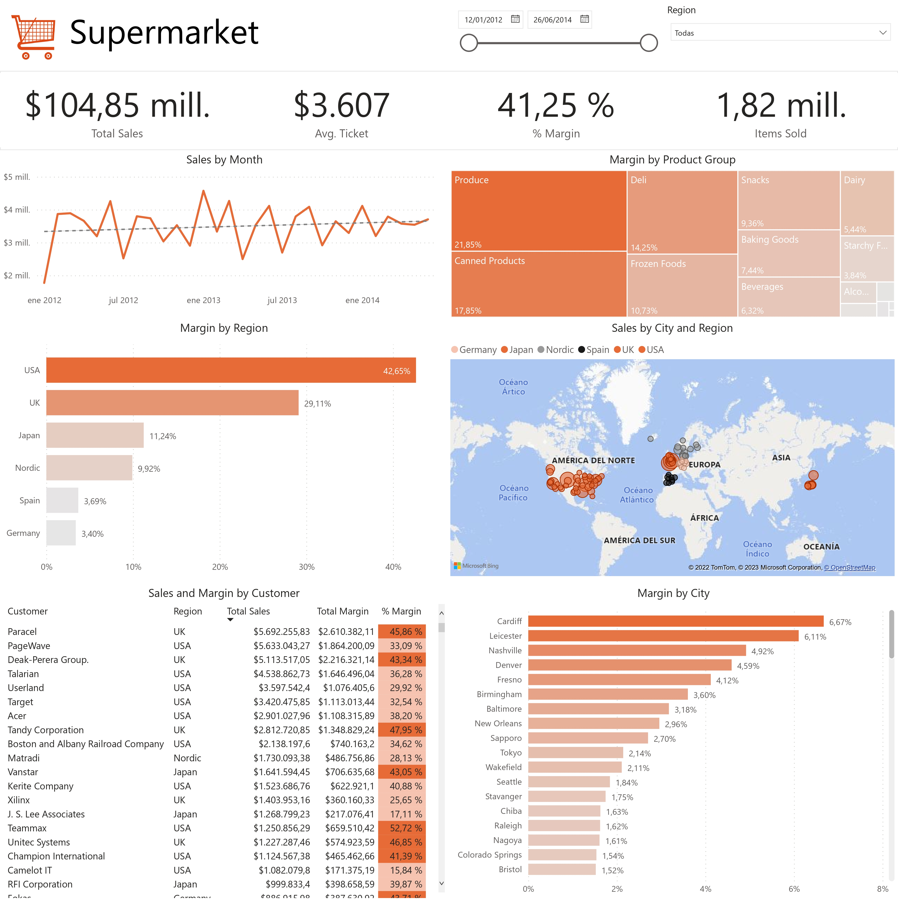
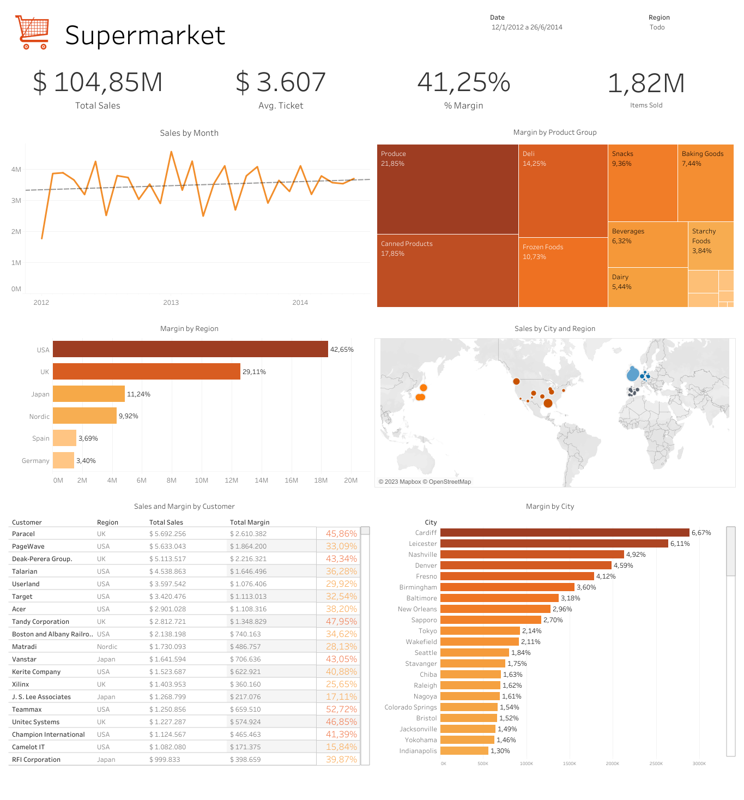

# Supermarket in Power BI #

## Introduction ##
The holding firm is the owner of a supermarket with locations all over the world. Sales data for the years 2012, 2013 and 2014 are shown, along with sales agents, items, and cities where sales were made. 

This project was done in
- [Power BI](https://github.com/morales-francisco/Dashboards/raw/main/Supermarket/Supermarket.pbix)
- [Tableau](https://public.tableau.com/app/profile/francisco8213/viz/SupermarketDashboard_16917085770440/SupermarketDashboard)

## Source ##
You can find the data sources in this [link](https://github.com/morales-francisco/Dashboards/tree/main/Supermarket/data).

## Case of Analysis ##

The Sales Manager from the holding request an executive sales report from the supermarkets. The goal is to examine sales data and offer insights that matter for making choices. 

## Data Cleaning ##
Being Excel files, they were only inserted using the Power BI option. Following this, I made a number of data cleanups:
- In the customer file there was a row that did not have the customer id, so I decided to exclude that row.

- The client 10021911 appears to be duplicated in the customer file; however, since each record corresponds to a different city, it would be necessary to speak with the manager to determine which of the two records is accurate. In this instance, I will assume that the record with the city code 65 is the correct one. 

- There were 47 records removed from the sales file for 2013 and 2014 because they lacked sales information. 

- I discovered sales and amounts with negative values in the sales files; I inferred that these were returns based on my assumption.

I applied the Power BI append functionality to combine the sales files for 2012, 2013 and 2014 so that I could consolidate all of the sales into a single table. Following that, I turned to putting the data modeling together and establishing the corresponding linkages. 

In the case of a scalable database, the most sensible course of action would be to work with incremental updates so that the query retrieves the new records or the transactions with changes, without the need to make a query and that it always brings all the historical records, as this would have a significant impact on the performance and health of the database.

## Dashboard Design ##

The measures created were:
- Total Sales: in order to be able to identify the amount of sales.

- Total Costs: it helped me to calculate the average margin of the company.

- Total Margin: the objective was to understand how much is the marginal contribution of sales.

- Items Sold: the objective was to measure the volume that the company sells.

- Total Distincts Customers: it helped me to determine the average ticket.

- Average Ticket: understand how much a customer spends on average in each transaction.

In the upper right corner of the dashboard are the filters.

These key performance indicators—sales, margin, average ticket, and number of things sold—are listed below. In order to provide the user more visibility, they are placed at the top of the dashboard.

A line chart and a treemap are also included. The line chart was created with the intention of helping users comprehend how sales change over time, as well as to examine seasonality and revenue trends. The treemap's objective was to clarify how sales margins were distributed throughout the various product categories.

I then created a map and a bar chart. Understanding the company's key geographic areas and top markets was the goal of the first visualization. The goal of the second was to examine where the money was coming from and how it was being distributed across the various regions.

Finally, a table with a heatmap-like format and a bar chart are included. The table's colors were chosen in the following manner: a brighter shade of orange is used for clients whose margin is less than the company average (41.25%), and a darker shade is used for clients whose margin exceeds the company average. The idea was to rapidly and clearly identify any clients with margins that deviate from or exceed the average for the business. The table is sorted in descending order by sales volume. Additionally, the bar chart enables the recognition of the cities that produce the highest marginal contributions.
### Power BI ###

[Download the .pbix file](https://github.com/morales-francisco/Dashboards/raw/main/Supermarket/Supermarket.pbix)

### Tableau ###

[Link to Tableau Public](https://public.tableau.com/app/profile/francisco8213/viz/SupermarketDashboard_16917085770440/SupermarketDashboard)

## Analysis and Conclusions ##
General information With an average margin of 41.25% and sales of more than 1.8 million items, more than $104 million was generated. The transactions date back to 2012, 2013, and 2014. Approximately 72% of the company's total margin is made up of the United States and the United Kingdom.

The main findings were:

- The company's sales show a clear seasonal pattern, with the months with the highest sales occurring in the first half of the year and the final half of the year seeing a noticeable decline in the company's total sales.

- The US and the UK are the company's two primary revenue generators, and I discovered that both regions simultaneously saw steep decreases in sales in July 2012 and April 2014. The other low peaks in this particular instance of the US were primarily observed in the second half of the year (November 2012, July 2013, October 2013). In relation to the UK, it is more evenly distributed (October and December 2012, June 2013 and April 2014).

- The trend line of the line graph makes it clear that there is a clear downward trend in revenues in the company's two primary markets (the US and the UK), while there is an upward trend in revenues in the remaining regions (Japan, the Nordics, Germany, and Spain). This is another significant point I would like to add.

- Regarding the margin of the different product lines, the categories of Produce, Canned Products, Deli and Frozen concentrate 65% of the company's total global margin.

- In the particular case of the US, there is a notable participation of the Snacks category, being the third line of products with the highest participation in the margin of the American market with 11.5%.

- In the case of the UK, it is noteworthy to highlight that the second category, canned products, which generates the biggest marginal contribution globally for the corporation, only accounts for 5.43% of the British market. With 17.46% of the market, the Baking Goods line comes in second in this area.

- I was able to examine the distribution of sales in the US using the map. A significant portion of it comes from retailers on the east coast and in the nation's center. I point out that the central-eastern part of the country has 4 of the top 5 cities for sales, with Nashville and Denver leading the list. The fact that the five US cities with the highest population share less than 5% of the market's total revenue, indicating that the majority of their sales originate in less densely populated places, was another significant finding. In the UK this pattern is repeated, since 4 of 5 cities that generate the most revenue in the UK are not in the top 10 of the most populated cities in the region. With Cardiff being the city with the greatest global margin in the corporation, there is a concentration in the middle of the island of the United Kingdom. In Japan, just three cities account for 60% of total revenue (Sapporo, Nagoya and Tokyo). And finally, coastal cities in the Nordic region provide a significant portion of the region's income (with access to the sea).

- After analyzing the various clients of the organization, I discovered that 7 of the 10 customers that made the most purchases globally had margins that were lower than the average for the business (41.25%). Six of them are US clients. In contrast, 8 out of the top 10 clients in the UK had a margin that was higher than the company's average. Japan and the Nordic region both have a 7 out of 10 ratio, which is indicative of a comparable condition.

